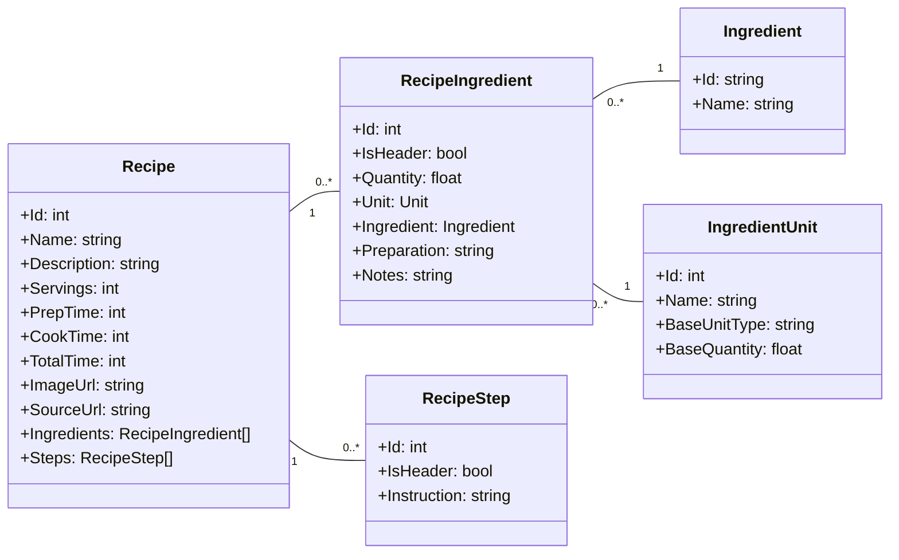

# Recipe classes

```mermaid
classDiagram
direction LR
    Recipe "1" -- "0..*" RecipeIngredient
    Recipe "1" -- "0..*" RecipeStep
    RecipeIngredient "0..*" -- "1" Ingredient
    RecipeIngredient "0..*" -- "1" IngredientUnit

    class Recipe {
        +Id: int
        +Name: string
        +Description: string
        +Servings: int
        +PrepTime: int
        +CookTime: int
        +TotalTime: int
        +ImageUrl: string
        +SourceUrl: string
        +Ingredients: RecipeIngredient[]
        +Steps: RecipeStep[]
    }

    class RecipeIngredient {
        +Id: int
        +IsHeader: bool
        +Quantity: float
        +Unit: Unit
        +Ingredient: Ingredient
        +Preparation: string
        +Notes: string
    }

    class Ingredient {
        +Id: string
        +Name: string
    }

    class RecipeStep {
        +Id: int
        +IsHeader: bool
        +Instruction: string
    }

    class IngredientUnit {
        +Id: int
        +Name: string
        +BaseUnitType: string
        +BaseQuantity: float
    }
```
